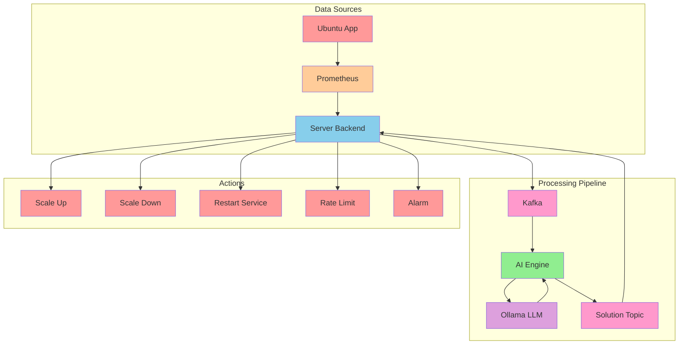
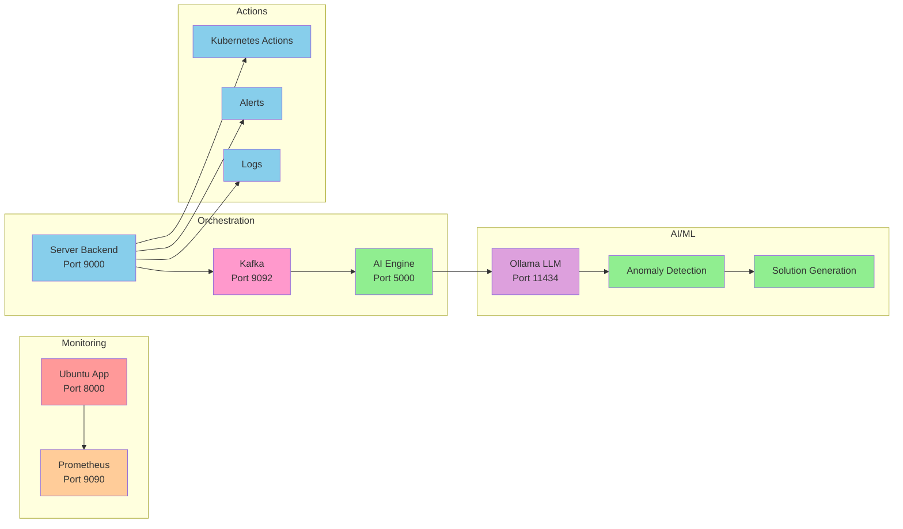
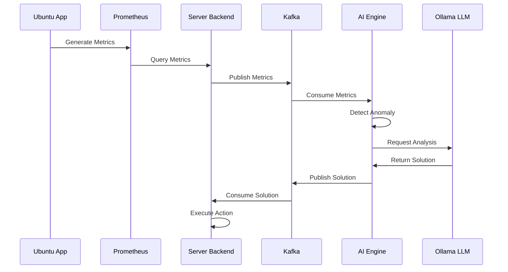
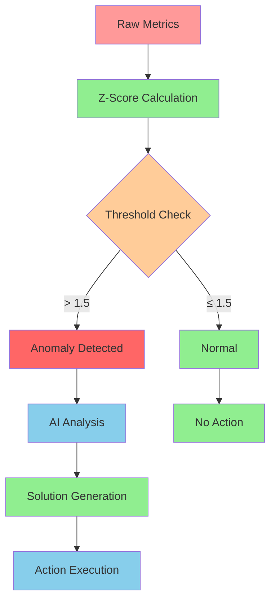
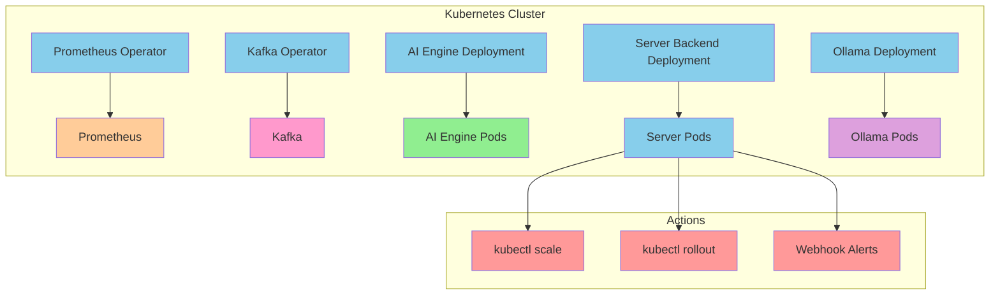

# Anomalyzer

A real-time anomaly detection and automated remediation system using AI/ML, Kafka, and microservices architecture.


https://github.com/user-attachments/assets/5e439e84-f3ea-4aaa-9437-3b8648c51fda


## Architecture Overview



## System Components



## Data Flow



## Features

- **Real-time Anomaly Detection**: Z-score based spike detection
- **AI-Powered Analysis**: LLM-based explanation and solution generation
- **Automated Remediation**: Kubernetes-native action execution
- **Microservices Architecture**: Scalable and maintainable design
- **Event-Driven Processing**: Kafka-based message queuing
- **Monitoring Integration**: Prometheus metrics collection

## Quick Start

### Prerequisites

- Docker and Docker Compose
- 8GB+ RAM (for Ollama LLM)
- Linux/macOS/Windows with Docker support

### Installation

1. **Clone the repository**
   ```bash
   git clone https://github.com/yourusername/anomalyzer.git
   cd anomalyzer
   ```

2. **Start the system**
   ```bash
   docker-compose up -d
   ```

3. **Verify all services are running**
   ```bash
   docker-compose ps
   ```

4. **Test the system**
   ```bash
   # Test Prometheus metrics
   curl http://localhost:9000/metrics-test
   
   # Send test anomaly
   curl -X POST http://localhost:9000/send-test-metric
   
   # Check server logs
   docker logs anomalyzer-server-1 --tail 20
   ```

## Service Details

### Ubuntu App (Port 8000)
- **Technology**: Go
- **Purpose**: Generates test metrics for Prometheus
- **Metrics**: `app_requests_total`, `http_request_duration_seconds`, `app_requests_errors_total`

### Prometheus (Port 9090)
- **Technology**: Prometheus
- **Purpose**: Metrics collection and storage
- **Configuration**: `prometheus.yml`

### Server Backend (Port 9000)
- **Technology**: Go
- **Purpose**: Orchestration and action execution
- **Endpoints**:
  - `/health` - Health check
  - `/metrics-test` - Query Prometheus metrics
  - `/send-test-metric` - Send test anomaly
  - `/action/*` - Execute remediation actions

### Kafka (Port 9092)
- **Technology**: Apache Kafka
- **Purpose**: Message queuing between services
- **Topics**:
  - `metrics-topic` - Raw metrics from server
  - `ai-solutions-topic` - AI-generated solutions

### AI Engine (Port 5000)
- **Technology**: Python
- **Purpose**: Anomaly detection and AI analysis
- **Components**:
  - Anomaly Detector (Z-score based)
  - LLM Integration (Ollama)
  - Solution Generator

### Ollama LLM (Port 11434)
- **Technology**: Ollama
- **Purpose**: Large Language Model for analysis
- **Model**: `llama2:7b-chat`

## Anomaly Detection

The system uses statistical methods to detect anomalies:



## Solution Types

The AI engine can generate the following solution types:

- **scale_up**: Increase service replicas
- **scale_down**: Decrease service replicas
- **restart_service**: Restart the service
- **rate_limit**: Apply rate limiting
- **alarm**: Send alert notifications
- **check_logs**: Analyze service logs
- **investigate**: Deep investigation
- **no_action**: No action required

## Development

### Project Structure

```
anomalyzer/
├── ai-engine/           # Python AI/ML service
│   ├── anomaly/         # Anomaly detection algorithms
│   ├── kafka/          # Kafka producer/consumer
│   ├── llm/            # LLM integration
│   └── main.py         # Main application
├── server/             # Go orchestration service
│   ├── cmd/            # Application entry point
│   ├── internal/       # Internal packages
│   └── go.mod          # Go dependencies
├── ubuntu/             # Go test application
├── docker-compose.yml  # Service orchestration
└── README.md          # This file
```

### Building Services

```bash
# Build all services
docker-compose build

# Build specific service
docker-compose build ai-engine
docker-compose build server
```

### Testing

```bash
# Test anomaly detection
curl -X POST http://localhost:9000/send-test-metric

# Test manual action
curl -X POST http://localhost:9000/action/scale-up

# Check AI engine logs
docker logs anomalyzer-ai-engine-1

# Check server logs
docker logs anomalyzer-server-1
```

## Monitoring

### Prometheus Metrics

- `app_requests_total`: Total request count
- `http_request_duration_seconds`: Request duration
- `app_requests_errors_total`: Error count

### Logs

```bash
# View all logs
docker-compose logs

# View specific service logs
docker-compose logs ai-engine
docker-compose logs server
```

## Production Deployment

### Kubernetes

The system is designed to be deployed on Kubernetes:



### Environment Variables

```bash
# Kafka Configuration
KAFKA_BROKERS=kafka:9092
KAFKA_TOPIC_METRICS=metrics-topic
KAFKA_TOPIC_SOLUTIONS=ai-solutions-topic

# Ollama Configuration
OLLAMA_HOST=http://ollama:11434
OLLAMA_MODEL=llama2:7b-chat

# Prometheus Configuration
PROMETHEUS_URL=http://prometheus:9090
```

## Contributing

1. Fork the repository
2. Create a feature branch
3. Make your changes
4. Add tests
5. Submit a pull request

## License

This project is licensed under the MIT License - see the LICENSE file for details.

## Support

For issues and questions:
- Create an issue on GitHub
- Check the documentation
- Review the logs for debugging

---

**Anomalyzer** - Intelligent anomaly detection and automated remediation for modern applications. 
